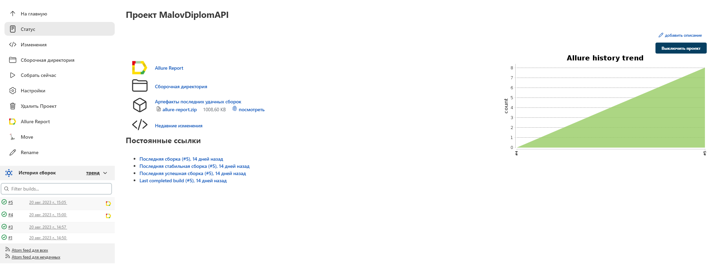
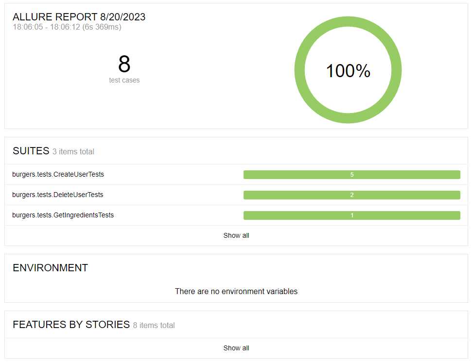

# Diplom_API

Проект по автоматизации тестирования для ресурса [Stellar Burgers](https://stellarburgers.nomoreparties.site/)

> Stellar Burgers - интернет магазин по продаже бургеров (учебный проект для тестирования)  
> Ссылка на [документацию](https://code.s3.yandex.net/qa-automation-engineer/java/cheatsheets/paid-track/diplom/api-documentation.pdf)


### Реализованные проверки:
* Успешное создание пользователя
* Создание пользователя с данными, которые уже есть в системе
* Разные варианты неуспешного создания пользователя
* Успешное удаление пользователя
* Удаление несущестувующего пользователя
* Получение списка ингредиентов

____
### Технологии и инструменты:
<p align="center">


</p>


____
<a id="jenkins"></a>
</a><a name="Сборка"></a>Сборка в [Jenkins](https://jenkins.autotests.cloud/job/MalovDiplomUI/)</a>
____




<a id="console"></a>
## Команды для запуска из терминала
___
***Локальный запуск:***
```bash  
gradle clean test 
```

#### Удаленный запуск тестов реализован через сборку в jenkins


<a id="allure"></a>
## </a> <a name="Allure"></a>Allure [отчет](https://jenkins.autotests.cloud/job/MalovDiplomAPI/5/allure/)</a>
___


<p align="center">  
  
</p>  
